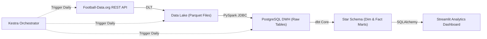

# ⚽ English Premier League (EPL) End-to-End Data Pipeline & Dashboard

Welcome to the **EPL End-to-End Data Engineering Project**! This project automates data extraction, storage, transformation, orchestration, and visualization of Premier League match and team statistics.

---

## 🏗️ Architecture Overview



---

## 📁 Repository Structure & Documentation

Below is the modular breakdown of the project. Click on any module link to view its detailed documentation:

- 📥 **[Ingestion Module](./ingestion/README.md)**: Automated data ingestion from REST API to local Parquet Data Lake using DLT.
- ⚡ **[Load Module](./load/README.md)**: High-performance data loading and deduplication from Parquet into PostgreSQL using PySpark.
- 🔄 **[Transform Module](./transform/README.md)**: Data modeling with dbt Core (Staging -> Intermediate -> Marts) and Data Quality testing.
- 🎼 **[Orchestration Module](./orchestration/README.md)**: Workflow orchestration, scheduling, and error handling using Kestra.
- 📊 **[Dashboard Module](./dashboard/README.md)**: Streamlit interactive analytics UI.

---

## 🚀 Quick Start Guide

### 1. Prerequisites
- Docker & Docker Compose
- `uv` (Fast Python Package Manager)

### 2. Launch Services
```bash
docker compose up -d
```

### 3. Run Pipeline via Kestra CLI / API
```bash
curl -u "admin@kestra.io:Admin1234!" -X POST http://localhost:8080/api/v1/executions/football/epl_pipeline
```

### 4. View Streamlit Dashboard
```bash
uv run streamlit run dashboard/app.py
```
