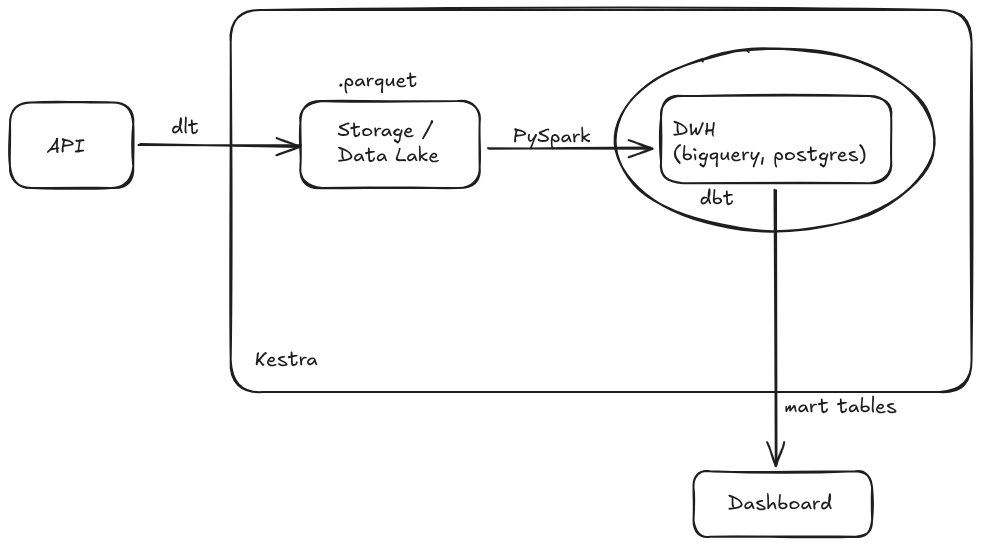

# ⚽ English Premier League (EPL) End-to-End Data Pipeline & Dashboard

This project automates data extraction, storage, transformation, orchestration, and visualization of Premier League team statistics.

Try it [here](https://epl-stat.streamlit.app/)

---

## 🏗️ Architecture Overview



---

## 📁 Repository Structure & Documentation

- `ingestion/` Data ingestion module from REST API to local Parquet Data Lake using `dlt`
- `load/` Data loading and deduplication from Parquet files into DWH (PostgreSQL) using PySpark
- `transform/` Data modeling and data transforming using dbt (Staging -> Intermediate -> Marts), Data quality testing
- `orchestration/` Kestra orchestration workflow
- `dashboard/` Streamlit dashboard UI

---

## 🚀 Local instalation

### 1. Prerequisites
- Docker
- `uv` (Package Manager)

### 2. Config environment (`.env.example`)
```
# Football API Token (Get free key from https://www.football-data.org/)
FOOTBALL_DATA_TOKEN=your_football_data_token_here

# PostgreSQL Database Connection Settings
POSTGRES_HOST=localhost
POSTGRES_PORT=5432
POSTGRES_DB=epl
POSTGRES_USER=root
POSTGRES_PASSWORD=root
```

### 3. Launch Services
- Includes PostgreSQL and Kestra containers
```bash
docker compose up -d
```

### 4. Run Pipeline via Kestra CLI / API
- Kestra UI on `localhost:8080 `
- Or run via CLI
```bash
curl -u "admin@kestra.io:Admin1234!" -X POST http://localhost:8080/api/v1/executions/football/epl_pipeline
```

### 4. View Streamlit Dashboard
```bash
uv run streamlit run dashboard/app.py
```
